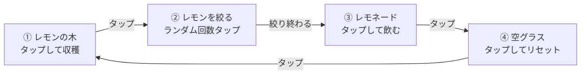

<div id="top"></div>

# Lemonade

Lemonade は，レモンの木を育てて絞り，レモネードを作って飲むまでの工程を，画像タップによる画面遷移で体験するミニアプリである．[Lemonade Codelab](https://developer.android.com/codelabs/basic-android-kotlin-training-project-lemonade?hl=ja&authuser=2#0) に沿って実装した．

---

## 使用技術一覧

<p style="display: inline">
  
  
  
  
  
  
</p>

---

## 目次

- [プロジェクトについて](#プロジェクトについて)
- [画面フロー](#画面フロー)
- [ファイル構成](#ファイル構成)
- [開発環境](#開発環境)
- [学んだこと](#学んだこと)
- [開き方](#開き方)
- [参考コース](#参考コース)

---

## プロジェクトについて

画面に表示された画像をタップすると次の工程に進む，シンプルなステートマシンとして実装している．レモンを絞る回数は毎回 2〜4 回のランダムな値で決まり，指定回数タップすると次のステップに遷移する．

<p align="right">(<a href="#top">トップへ戻る</a>)</p>

---

## 画面フロー



| Step | 画像 | 遷移条件 |
|---|---|---|
| 1. レモンの木 | `lemon_tree` | タップで Step 2 へ，同時に絞る回数（2〜4）を抽選 |
| 2. レモンを絞る | `lemon_squeeze` | タップごとに残り回数を減らし，0 になったら Step 3 へ |
| 3. レモネード | `lemon_drink` | タップで Step 4 へ |
| 4. 空グラス | `lemon_restart` | タップで Step 1 へ戻る |

<p align="right">(<a href="#top">トップへ戻る</a>)</p>

---

## ファイル構成

```text
app/src/main/java/com/example/lemonade/
├── MainActivity.kt      # LemonadeApp / LemonTextAndImage
└── ui/theme/            # Color / Theme / Type
```

<p align="right">(<a href="#top">トップへ戻る</a>)</p>

---

## 開発環境

| 項目 | バージョン |
|---|---|
| Kotlin | 2.2.10 |
| Android Gradle Plugin | 9.1.1 |
| Compose BOM | 2024.09.00 |
| compileSdk / targetSdk / minSdk | 37 / 36 / 24 |

<p align="right">(<a href="#top">トップへ戻る</a>)</p>

---

## 学んだこと

- 複数の状態（`currentStep` / `squeezeCount`）を組み合わせた画面制御
- `when` 式によるステップごとの表示切り替え
- `Scaffold` + `CenterAlignedTopAppBar` を使った画面構成
- ランダム値を使った処理分岐（`(2..4).random()`）

<p align="right">(<a href="#top">トップへ戻る</a>)</p>

---

## 開き方

Android Studio で `File > Open` からこの `Lemonade` フォルダを選択する．

<p align="right">(<a href="#top">トップへ戻る</a>)</p>

---

## 参考コース

[Lemonade Codelab](https://developer.android.com/codelabs/basic-android-kotlin-training-project-lemonade?hl=ja&authuser=2#0)

<p align="right">(<a href="#top">トップへ戻る</a>)</p>
