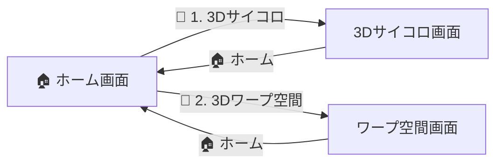

<div id="top"></div>

# XRtest

XRtest（XR Kotlin Lab）は，`Canvas` と行列演算を使って 3D 風の表現を Jetpack Compose 上で試作した検証用アプリである．他のプロジェクトと異なり，決まったコースには沿わない単発の自主的な試作であり，実際の Android XR（Jetpack XR SDK）は使用していない．

---

## 使用技術一覧

<p style="display: inline">
  
  
  
  
  
  
</p>

---

## 目次

- [プロジェクトについて](#プロジェクトについて)
- [画面構成](#画面構成)
- [ファイル構成](#ファイル構成)
- [開発環境](#開発環境)
- [学んだこと](#学んだこと)
- [開き方](#開き方)
- [注意点](#注意点)

---

## プロジェクトについて

ホーム画面から 2 つのデモ画面に遷移できる構成になっている．いずれも `Canvas` 上で座標変換を行い，3D 風の見え方を Compose だけで表現している．

<p align="right">(<a href="#top">トップへ戻る</a>)</p>

---

## 画面構成



| 画面 | 内容 |
|---|---|
| ホーム | 各デモ画面への遷移ボタンを表示 |
| 3Dサイコロ | 立方体をドラッグで回転，ボタンでランダムな目まで回転アニメーション |
| 3Dワープ空間 | 500個の点を疎視投影し，長押しで加速するスターフィールド表現 |

<p align="right">(<a href="#top">トップへ戻る</a>)</p>

---

## ファイル構成

```text
app/src/main/java/com/example/xr_test/
├── MainActivity.kt      # HomeScreen / Interactive3DDiceScreen / StarfieldScreen
└── ui/theme/            # Color / Theme / Type
```

<p align="right">(<a href="#top">トップへ戻る</a>)</p>

---

## 開発環境

| 項目 | バージョン |
|---|---|
| Kotlin | 2.2.10 |
| Android Gradle Plugin | 9.1.1 |
| Compose BOM | 2024.09.00 |
| compileSdk / targetSdk / minSdk | 37 / 36 / 24 |

<p align="right">(<a href="#top">トップへ戻る</a>)</p>

---

## 学んだこと

- `Canvas` 上での 3D 座標変換（回転・透視投影）と `Path` 描画
- `detectDragGestures` / `detectTapGestures` によるジェスチャー処理
- `Animatable` + `coroutineScope.launch` を使ったアニメーション制御
- `withFrameNanos` を使ったフレームごとの再描画（簡易ゲームループ）

<p align="right">(<a href="#top">トップへ戻る</a>)</p>

---

## 開き方

Android Studio で `File > Open` からこの `XRtest` フォルダを選択する．

<p align="right">(<a href="#top">トップへ戻る</a>)</p>

---

## 注意点

- プロジェクト名・パッケージ名に「XR」を含むが，Jetpack XR SDK やヘッドセット向け API は使用していない．すべて通常の Android 端末上の `Canvas` 描画による疑似 3D 表現である．

<p align="right">(<a href="#top">トップへ戻る</a>)</p>
